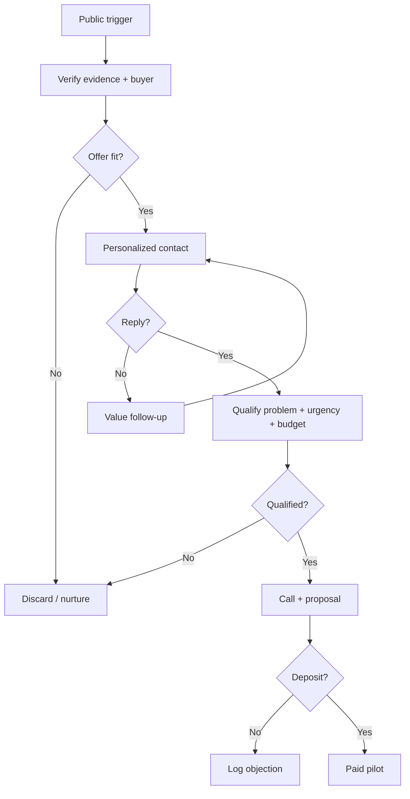
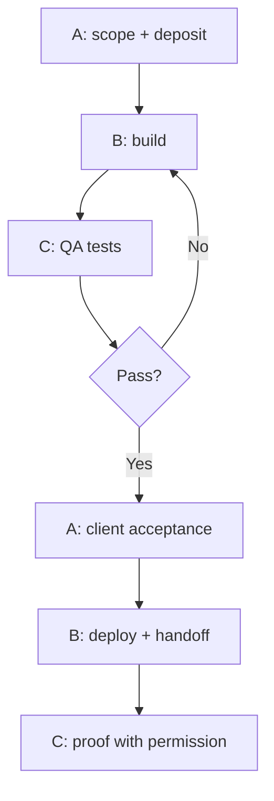

# CORE UML
## Client acquisition

```mermaid
flowchart TD
A[Public trigger] --> B[Verify evidence + buyer]
B --> C{Offer fit?}
C -- No --> D[Discard / nurture]
C -- Yes --> E[Personalized contact]
E --> F{Reply?}
F -- No --> G[Value follow-up]
G --> E
F -- Yes --> H[Qualify problem + urgency + budget]
H --> I{Qualified?}
I -- No --> D
I -- Yes --> J[Call + proposal]
J --> K{Deposit?}
K -- No --> L[Log objection]
K -- Yes --> M[Paid pilot]
```
## Delivery

```mermaid
flowchart TD
A[A: scope + deposit] --> B[B: build]
B --> C[C: QA tests]
C --> D{Pass?}
D -- No --> B
D -- Yes --> E[A: client acceptance]
E --> F[B: deploy + handoff]
F --> G[C: proof with permission]
```