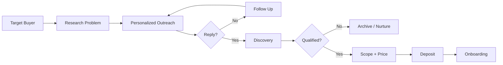
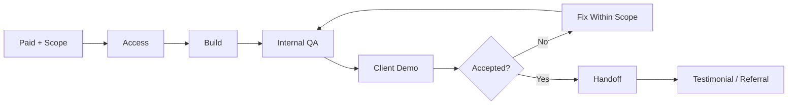
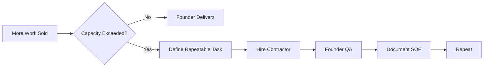

# FLOW VELLO — SIMPLE UML WORKFLOWS

These diagrams are intentionally short. Use them to remember the system, not to decorate the repository.

## 1. Acquisition

## 2. Delivery

## 3. Hiring

## 4. Revenue loop

The loop is the business. The tools are replaceable.
