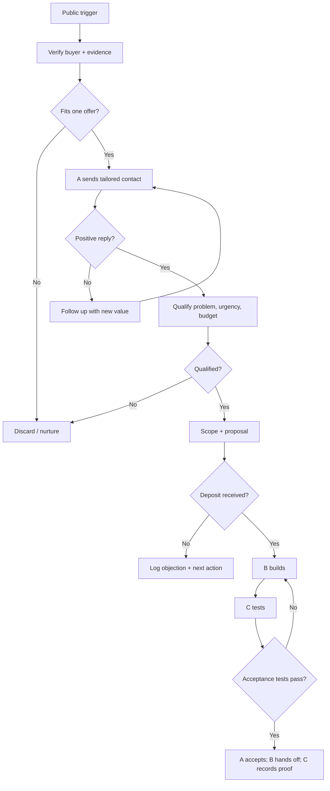

# FLOW VELLO WORKFLOWS

```mermaid
flowchart TD
A[Public trigger] --> B[Verify buyer + evidence]
B --> C{Fits one offer?}
C -- No --> D[Discard / nurture]
C -- Yes --> E[A sends tailored contact]
E --> F{Positive reply?}
F -- No --> G[Follow up with new value]
G --> E
F -- Yes --> H[Qualify problem, urgency, budget]
H --> I{Qualified?}
I -- No --> D
I -- Yes --> J[Scope + proposal]
J --> K{Deposit received?}
K -- No --> L[Log objection + next action]
K -- Yes --> M[B builds]
M --> N[C tests]
N --> O{Acceptance tests pass?}
O -- No --> M
O -- Yes --> P[A accepts; B hands off; C records proof]
```