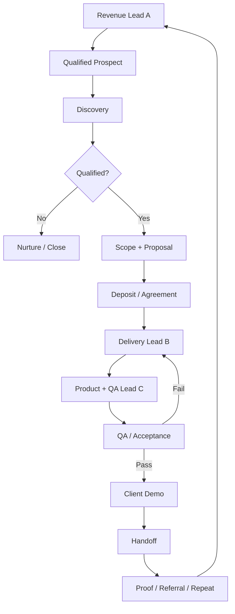
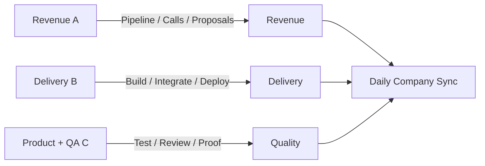
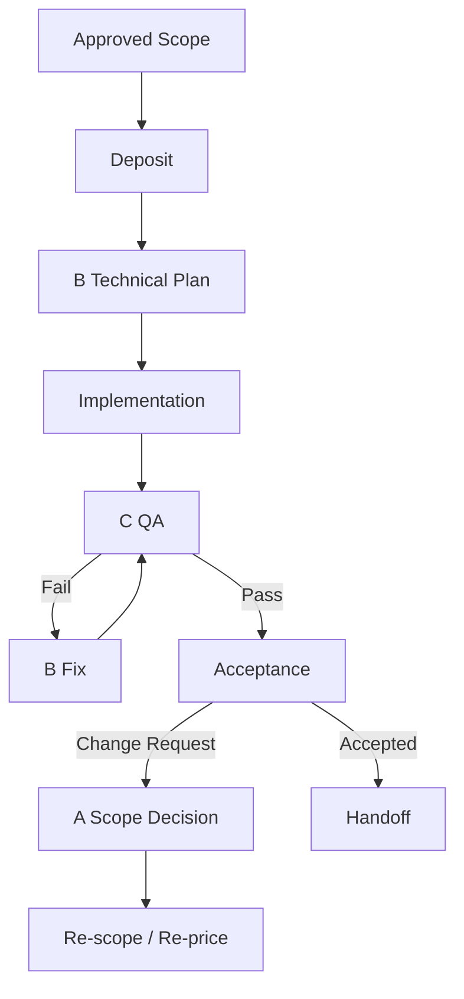
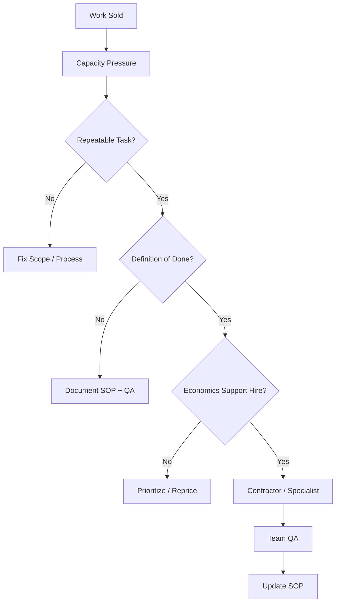

# Flow Vello — Three-Person Operating Workflows

## 1. Company Revenue + Delivery

## 2. Daily Ownership

## 3. Client Project Gate

## 4. Hiring Gate

## 5. Critical Ownership Rule
- Revenue: A
- Delivery: B
- Quality/Systems: C
- Company-wide priorities: one named DRI per decision

Never use "everyone owns it" for an outcome.