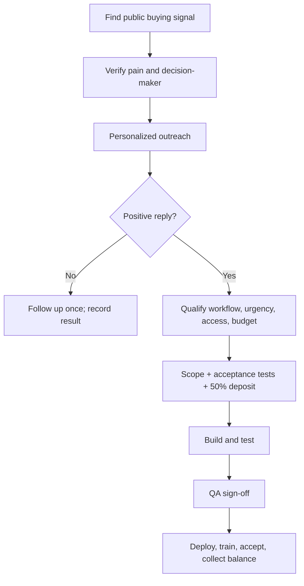

# Core Workflow UML

```mermaid
flowchart TD
A[Find public buying signal] --> B[Verify pain and decision-maker]
B --> C[Personalized outreach] --> D{Positive reply?}
D -- No --> E[Follow up once; record result]
D -- Yes --> F[Qualify workflow, urgency, access, budget]
F --> G[Scope + acceptance tests + 50% deposit] --> H[Build and test]
H --> I[QA sign-off] --> J[Deploy, train, accept, collect balance]
```