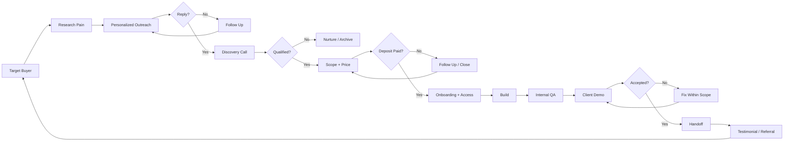
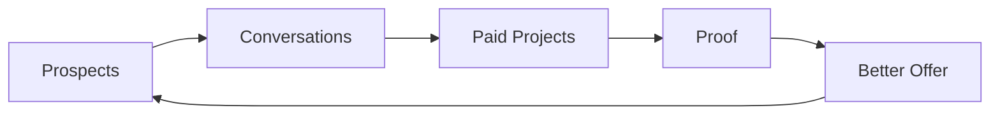
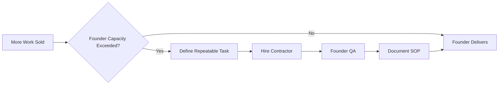

# Flow Vello Agency OS — Zero to $1,000

This repository is the operating system for running Flow Vello from zero revenue as a solo operator.

## Stage 1 objective

Get the first paying client, deliver a small measurable result, collect proof, repeat.

Do not build a large agency before you can sell and deliver one offer repeatedly.

## Core services

1. Workflow Automation
2. Custom AI Agents
3. WhatsApp & Messaging Automation
4. AI Customer Support
5. Sales Automation
6. Executive Dashboards
7. Custom Software Development

## Stage 1 offer

Sell a small, fixed-scope automation sprint.

Examples:
- lead capture -> CRM -> notification
- WhatsApp lead qualification -> calendar
- missed inquiry -> instant follow-up
- repetitive spreadsheet/reporting workflow -> automated system
- simple internal AI assistant connected to approved business data

Target first-project price: **$150–$500**.
After proof: **$500–$1,000+**.

## Agency workflow UML

The complete operating workflow is:

### Revenue loop

### Hiring trigger

## Daily non-negotiables

- 30–50 targeted prospects researched
- 20–30 personalized first contacts
- 10 follow-ups
- 1 sales/proof asset improved
- 1 delivery block
- CRM updated before stopping

No YouTube strategy binge. No endless website redesign. No learning a new tool unless a live client requires it.

## Operating loop

PROSPECT -> DIAGNOSE -> OUTREACH -> DISCOVERY -> SCOPE -> DEPOSIT -> BUILD -> QA -> DEMO -> HANDOFF -> TESTIMONIAL/REFERRAL -> REPEAT

The documentation is useful only if it changes what gets done today.
